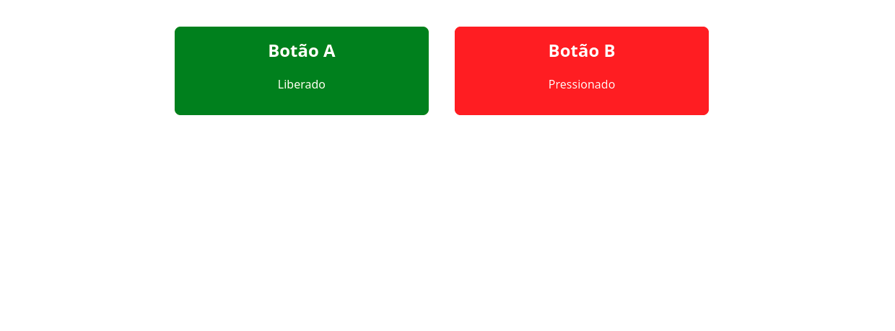

# Monitor de Botões

Este projeto implementa um servidor web no Raspberry Pi Pico W que monitora o estado de dois botões (A e B) em tempo real. O estado dos botões é exibido em uma página web que atualiza a cada um segundo.

## Como Funciona

1. O Pico W se conecta à rede Wi-Fi definida no código
2. Inicia um servidor web na porta 80
3. Serve uma página HTML estática quando acessado por um navegador
4. A página HTML contém JavaScript que faz requisições a cada segundo para o endpoint `/api/buttons`
5. O servidor retorna dados JSON contendo o estado atual dos botões
6. O JavaScript atualiza a interface visual para refletir o estado dos botões

## Estrutura do Código

- **Inicialização**: Configuração do Wi-Fi, GPIO e servidor TCP
- **Rotas HTTP**:
  - `/` (raiz): Retorna a página HTML principal
  - `/api/buttons`: Retorna o estado dos botões em formato JSON
- **JavaScript do Cliente**: Realiza requisições periódicas usando a Fetch API

## Dashboard

